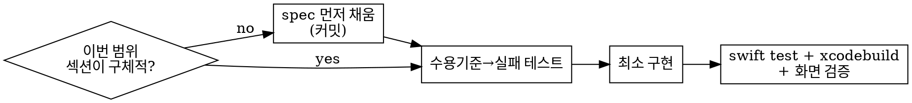

# implement-spec

## Overview

이 레포는 **Spec-Driven Development(SDD)**: `docs/specs/<feature>/spec.md` 가 화면 정책의 SSoT 다.
코드는 spec 의 구현일 뿐이다. **spec 을 읽고/채운 뒤에만 코드를 쓴다.**

**핵심 원칙:** 구현이 spec 과 어긋나면 코드 버그가 아니라 **spec 위반**이다 — spec 을 먼저 고친다.

## When to Use

- 화면(View+Reducer)·Client 를 새로 만들거나 동작을 바꿀 때
- spec 이 골격(TBD)이라 이번 구현 범위의 섹션을 채워야 할 때
- 코드와 spec 이 달라 보일 때(divergence)

NOT: 오타·리네임·포맷팅 등 정책과 무관한 변경.

## Workflow (순서 고정)

1. **Spec 찾기/구체화.** `docs/specs/<feature>/spec.md` 를 연다. 이번 구현 슬라이스에 해당하는 섹션
   (요구사항·UI 상태·엣지케이스·API 명세·정책·TCA 매핑·수용 기준)이 `TBD` 면 **먼저 채운다**.
   코드보다 spec 커밋이 앞선다. (없으면 `_template/spec.md` 복사)
2. **매핑.** spec §7 → `State`/`Action`/`Client`, spec §8 수용 기준 → `TestStore` 시나리오로 1:1 변환.
3. **TDD.** 수용 기준에서 **실패하는 TestStore 테스트 먼저** 작성 → 통과시키는 최소 구현.
   REQUIRED: superpowers:test-driven-development.
4. **하네스 규칙 준수.** View+Reducer+`@ObservableState`; 의존성은 `@DependencyClient`(live/test/preview 3종);
   `Sendable`, 테스트/리듀서 타입 `@MainActor`; 모듈 추가는 `Package.swift` 만 편집.
5. **검증 게이트.** `swift test --package-path GithubSearchPackage` → `xcodebuild build/test`(iOS 17 sim).
   UI 구조/표시는 `verify-screen` 스킬로 확인(화면검증 절차 SSoT). REQUIRED: superpowers:verification-before-completion.
6. **동기화.** 구현 중 정책이 바뀌면 spec 으로 돌아가 갱신 후 코드 반영. spec ↔ 코드 항상 일치.

## Quick Reference

| spec 섹션 | 코드 산출물 |
|-----------|-------------|
| §2 요구사항 / §3 UI 상태 | `@ObservableState` 필드, 파생 프로퍼티 |
| §4 엣지케이스 / §6 정책 | 리듀서 분기, 검증 로직 |
| §5 API 명세 | `@DependencyClient` closure 시그니처 |
| §7 TCA 매핑 | State/Action/Client 골격 |
| §8 수용 기준 | `TestStore` 테스트(체크박스 1:1) |

## Common Mistakes

- 리듀서부터 짜고 spec 을 나중에 맞춤 → **금지**. spec → 테스트 → 코드 순서.
- 수용 기준을 테스트로 옮기지 않음 → 각 `- [ ]` 가 테스트 1개에 대응해야 함.
- 구현 범위 섹션에 `TBD` 를 남김 → 채우고 시작.
- 정책 변경을 코드에만 반영 → spec 의 변경 이력에 함께 기록.

## Red Flags — STOP

- "spec 은 나중에 채우자" / "코드부터 보고 spec 맞추자"
- 수용 기준 없이 테스트 작성 / 테스트 없이 구현
- spec 과 코드가 다른데 "코드가 맞으니 spec 무시"

→ 멈추고 spec 부터.
